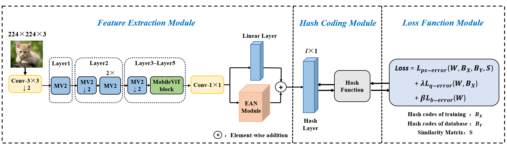

# HALH
A Lightweight Image Hashing Retrieval Method Based on Hybrid Neural Networks and Asymmetric Learning



# Installation
pip install -r requirements.txt

# Train
python train.py \
eg.python train.py --dataset cifar-10 --batch-size 64 --lr 0.0005 --code-length 32 --max-epoch 5 --gpu 0

# Test
python test.py \
eg.python test.py

# Dataset
This project uses **CIFAR-10** and **NUS-WIDE** datasets.

- **NUS-WIDE**: Download it [here](https://github.com/Tree-Shu-Zhao/DSDH_PyTorch).  
- **CIFAR-10**: Automatically downloaded by PyTorch:

```python
train_dataset = datasets.CIFAR10(root='./data', train=True, download=True)
test_dataset = datasets.CIFAR10(root='./data', train=False, download=True)
